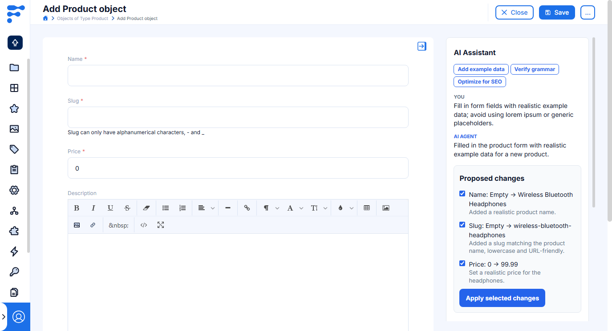
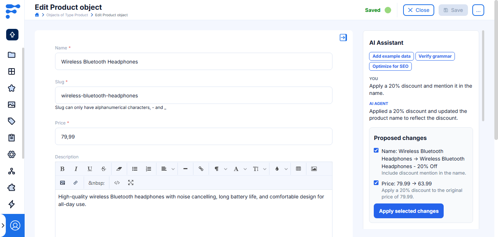

<a href="https://flotiq.com/">
    
</a>

# AI Assistant



## Quick start

1. Run `yarn install` to install dependencies.
2. Run `yarn start` to start development mode at `https://localhost:3053`.
3. Add the plugin manifest from `https://localhost:3053/plugin-manifest.json` in Flotiq.
4. Open the plugin settings and configure an OpenAI API key.

The chat is available in the sidebar of every editable content-object form (it does not render when the form is disabled or read-only). It receives the current form values, field schema, and field configuration, so it can answer questions about the object and propose changes to its fields.

Proposed changes are never saved automatically. Review the proposed field values, select the changes to keep, and use **Apply selected changes**. The normal Flotiq form save action is still required to persist the object.

The sidebar keeps its conversation, typed draft, and pending proposals when Flotiq rerenders the form after validation. Each open form has a separate chat session, and prior messages and replies in that session are sent back to OpenAI as context on each new request (bounded to the last 10 turns), so follow-ups like "make it shorter" work.

## Default prompts

Plugin settings include **Default prompts**, a list that renders compact shortcut buttons above the chat history. Each item contains:

- **Title**: the label shown on the shortcut button.
- **Prompt**: the instruction sent to the AI agent when the button is clicked.

Both fields are standard text inputs. Default prompts are optional and do not replace writing a custom chat message.

## Proposed field values

The assistant sends the Content Type Definition schema and field configuration to OpenAI. Before a proposal is shown or applied, the plugin validates that the field exists, the proposed value matches its JSON Schema type, and the value differs from the current form value.

For `select` fields, including fields nested in lists, the proposal must match one of the configured options.

For relation and media fields, the plugin fetches a short list of existing candidate objects through the Flotiq API client and sends that list to OpenAI; the assistant can only pick from those candidates and can never invent a related object. Uploading a new media file is not supported — only existing media library objects can be selected.



## OpenAI API key

The key is stored in plugin settings and used directly by the browser when a message is sent to OpenAI. This avoids committing the key to the plugin source, but it is not server-side secret storage. Use a restricted, revocable OpenAI key with spending limits. Use a backend proxy instead when the key needs stronger protection or broad account access.

## Requests to OpenAI

The plugin calls the OpenAI Responses API (`/v1/responses`) directly from the browser. The model defaults to `gpt-4.1-mini` and can be overridden per-plugin-instance with the **OpenAI model** setting.

## Flotiq permissions

`plugin-manifest.json` requests read-only access to content objects (`CO`, `ctdName: "*"`, plus an explicit `_media` entry) so it can fetch candidate related objects for relation and media fields. It reads the current form values and Content Type Definition from the `flotiq.form.sidebar-panel::add` event payload, and writes proposed values back through `FormApi.setFieldValue`.

## AI agent guidance

This template includes workspace instructions and skills for GitHub Copilot:

- [Copilot instructions](.github/copilot-instructions.md) define the repository architecture, Flotiq API and credential rules, and the template-demo cleanup checklist.
- [`flotiq-plugins`](.github/skills/flotiq-plugins/SKILL.md) guides agents through adding UI elements to CTD grids and forms, selecting Flotiq events, using `FormApi` and schema modals, configuring plugin settings, updating manifest permissions, integrating APIs, and installing/publishing the plugin.

The skill can be discovered automatically from a matching request or invoked as `/flotiq-plugins`. Its focused references cover events and UI placement, manifest and API access, forms and settings, credential handling, and installation.

## Dev environment

Dev environment is configured to use:

- `prettier` - best used with automatic format on save in IDE; run `yarn format` before committing changes
- `eslint` - it is built into both `start` and `build` commands

## Output

The plugins are built into a single `dist/index.js` file. The manifest is copied to `dist/plugin-manifest.json` file.

## Loading the plugin

**Warning:** While developing, you can use `https://localhost:3053/plugin-manifest.json` address to load the plugin manifest. Make sure your browser trusts the local certificate on the latter, to be able to use it e.g. with `https://editor.flotiq.com`

### URL

**Hint**: You can use localhost url from development mode `https://localhost:3053/index.js`

1. Open Flotiq editor
2. Open Chrome Dev console
3. Execute the following script
   ```javascript
   FlotiqPlugins.loadPlugin('flotiq.ai-form-assistant', '<URL TO COMPILED JS>');
   ```
4. Navigate to the view that is modified by the plugin

### Directly

1. Open Flotiq editor
2. Open Chrome Dev console
3. Paste the content of `dist/index.js`
4. Navigate to the view that is modified by the plugin

## Production deployment

Host `dist/index.js` and `dist/plugin-manifest.json` over HTTPS, then replace the local `url` in `plugin-manifest.json` with the public URL before building the release.

## Next steps

Ideas for future work on this plugin, not yet implemented:

- **Detailed OpenAI error.** Failures currently collapse to generic messages (e.g. "OpenAI request failed."). Showing the non-key-revealing part of the error (rate limit vs. invalid key vs. network) would speed up troubleshooting.
